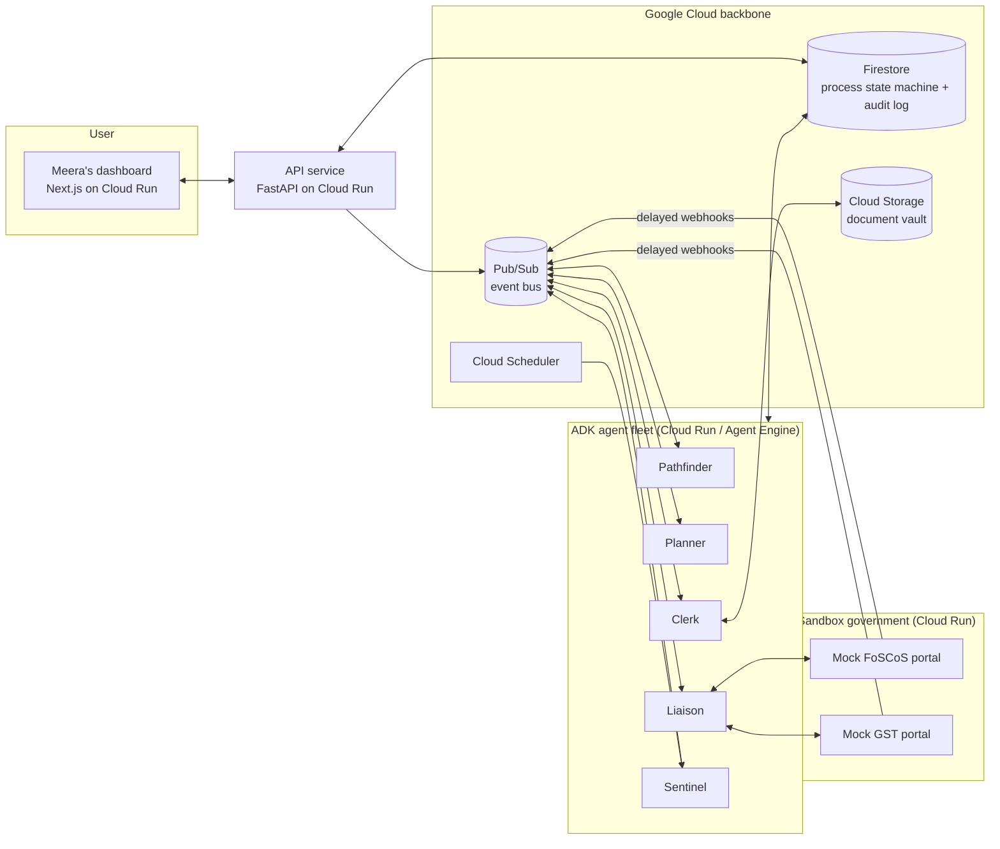

# LalFita — Concept & Build Plan

**Hackathon:** All Things Agentic Hackathon (Google) · **Track:** The Taskmaster
**Deadline:** August 31, 2026 · **Team:** 4+ · **Stack:** Gemini + ADK + Google Cloud

---

## 1. One-line pitch

An autonomous agent fleet that takes a plain-language goal — *"make my home
food business legal"* — and runs the entire bureaucratic journey end-to-end:
researching which registrations apply, validating documents before they cause
rejections, preparing applications, watching for government responses, and
chasing deadlines for weeks, asynchronously.

## 2. The problem (the 40% "Innovation & Operational Utility" story)

Registering a small food business in India typically means navigating **three
or more separate authorities**, each with its own portal, forms, fees, and
failure modes:

| Registration | Authority / portal | Pain points |
|---|---|---|
| FSSAI registration or license | FoSCoS portal (Form A / Form B, tiered by turnover) | Tier confusion, document checklists, possible inspection |
| GST registration | gst.gov.in | Commonly required to sell via delivery/e-commerce platforms; **REG-03 clarification notices must be answered within ~7 working days or the application is rejected** |
| Udyam (MSME) registration | udyamregistration.gov.in | Optional but unlocks benefits; another portal, another form |
| Municipal trade license | City-specific | Wildly inconsistent, often offline |

The failure modes are silent and brutal:

- **Applicability confusion** — which tier of FSSAI? Is GST mandatory for me?
  Rules change; blog posts are stale; owners guess wrong.
- **Document mismatches** — a name spelled differently on PAN vs. Aadhaar vs.
  a utility bill is a classic rejection cause, discovered only weeks later.
- **Deadline chains** — clarification notices arrive mid-process with short
  reply windows. Miss one and you restart from zero.
- **Long-running statefulness** — the whole journey spans weeks. Humans lose
  the thread; an agent with a persistent state machine does not.

This is precisely the Taskmaster brief: *"Find a messy, multi-step chore…
build an agent that handles the details, sends the right info to the right
places, and proves it can do the heavy lifting for you."*

**Generalization:** the engine is process-agnostic. GST + FSSAI is the
flagship journey; the same plan/execute/watch/chase loop applies to visas,
insurance claims, or permits anywhere. (One slide of the demo makes this
point — judges outside India should see their own bureaucracy in it.)

## 3. Flagship demo journey

**Persona:** Meera runs a home kitchen in Ahmedabad selling snacks. She wants
to go legitimate and list on food delivery platforms.

1. **Intake (2 min of her time).** Meera tells LalFita her goal in plain
   language. The **Pathfinder** agent interviews her briefly (turnover,
   products, home vs. commercial premises, sales channels) and — using
   Gemini with Google Search grounding — determines the applicable set:
   FSSAI Basic Registration (Form A), GST registration (platform selling),
   Udyam (recommended).
2. **Plan.** The **Planner** agent compiles a dependency-ordered process
   graph with document requirements, fees, and expected timelines, persisted
   in Firestore. Meera sees it as a live timeline on her dashboard.
3. **Documents.** Meera photographs her PAN, Aadhaar, and electricity bill.
   The **Clerk** agent (Gemini vision) extracts fields, **cross-validates
   names/addresses across documents**, and flags a mismatch *before*
   submission — turning a 3-week silent rejection into a 30-second fix.
4. **Prepare & submit.** Clerk fills the application forms. Nothing leaves
   the system without Meera's tap on an **approval gate** (real portals are
   OTP-gated anyway — human-in-the-loop is both honest and a security
   feature).
5. **The async magic.** Days pass. A clarification notice (GST REG-03
   analog) arrives at 2 AM. The **Liaison** agent parses it, drafts the
   reply with the supporting document attached, and queues it for approval.
   The **Sentinel** agent (Cloud Scheduler) counts down the 7-working-day
   window and escalates nudges as it shrinks. Meera approves over breakfast.
6. **Done.** Registration numbers land in her document vault with a full
   audit trail of everything the agents did while she was busy cooking.

**Demoability:** government portals are OTP/captcha-gated and can't (and
shouldn't) be scripted. The demo runs against a **sandbox government** — two
mock portal services (FoSCoS-like, GST-like) we deploy on Cloud Run that
accept submissions and emit realistic delayed responses (acknowledgements,
clarification notices, approvals) via Pub/Sub, on a **time-compressed
simulation clock** so three weeks of process play out during the demo. This
is a feature, not a hack: it makes the event-driven architecture visible and
the demo reproducible by judges with one command.

## 4. Agent fleet & architecture (the 30% "Architectural Discipline" story)

Five specialized ADK agents, decoupled through Pub/Sub, sharing state only
through Firestore:

- **Pathfinder** — applicability research. Gemini + Search grounding;
  outputs a requirements determination with citations. Rules are researched,
  not hardcoded, so the engine generalizes.
- **Planner** — compiles requirements into a per-user process graph (state
  machine) in Firestore; recomputes when reality diverges from plan.
- **Clerk** — document intake, Gemini-vision extraction, cross-document
  validation, form filling (PDF/portal payloads).
- **Liaison** — outbound submissions and inbound watching; parses
  counterparty responses, classifies them (ack / notice / approval /
  rejection), drafts replies.
- **Sentinel** — deadline watchdog driven by Cloud Scheduler; escalating
  notifications; wakes Liaison/Planner when clocks run down.

Discipline points we will make explicit in the repo and video:

- **Decoupling:** agents never call each other directly; every hand-off is a
  Pub/Sub event, every fact lives in Firestore. Any agent can be redeployed
  independently.
- **State management:** each journey is an explicit, inspectable state
  machine document with an append-only audit log — the dashboard timeline
  renders straight from it.
- **Idempotency:** event handlers are idempotent (Pub/Sub is at-least-once).
- **Security:** human approval gates on all outbound actions; PII segregated
  in Firestore with security rules; documents in Cloud Storage behind signed
  URLs; least-privilege service accounts per agent.
- **Model economics:** Gemini Flash for routine classification/extraction,
  Pro reserved for Pathfinder's research reasoning.

## 5. Judging criteria mapping

| Criterion | Weight | How LalFita scores |
|---|---|---|
| Innovation & Operational Utility | 40% | Removes weeks of real, quantifiable friction autonomously; the async notice-handling loop is genuine background agency, not a chat wrapper |
| Architectural Discipline & Tech Stack | 30% | Event-driven decoupled fleet, explicit state machines, idempotent handlers, HITL security gates, per-agent least privilege |
| Demo & Production Readiness | 30% | Time-compressed sandbox makes a 3-week process demoable in 3 minutes; one-command deploy; architecture diagram; judges can run the whole journey themselves |

## 6. Demo video outline (~3 min)

1. **0:00–0:30** — The pain: montage of portals/forms; "a name mismatch costs
   you three weeks." Bureaucracy is universal — India is our proving ground.
2. **0:30–1:00** — Intake: Meera states her goal; Pathfinder's determination
   appears with citations; the plan timeline renders.
3. **1:00–1:40** — Clerk catches the PAN/utility-bill name mismatch live.
4. **1:40–2:30** — The async core: simulation clock accelerates; 2 AM notice
   arrives; Liaison drafts the reply; Sentinel's countdown; one-tap approval
   at breakfast. Cut to **Cloud Run dashboard + Pub/Sub metrics + Firestore
   console** as proof it runs on Google Cloud.
5. **2:30–3:00** — Approvals land; audit trail scrolls; generalization slide;
   architecture diagram beauty shot.

## 7. Two-week build plan (4 workstreams)

| Days | A — Agent core | B — Sandbox & integrations | C — Dashboard | D — Infra & assets |
|---|---|---|---|---|
| 1–2 | ADK skeleton, agent contracts, Firestore schema | Mock portal API design, response scripts | Next.js scaffold, timeline component | GCP project, CI, Cloud Run deploys, Pub/Sub topics |
| 3–6 | Pathfinder + Planner + Clerk (vision validation) | Both mock portals live w/ delayed webhooks + sim clock | Intake flow, document upload, approval gate UI | Terraform/gcloud scripts, secrets, service accounts |
| 7–9 | Liaison + Sentinel, end-to-end journey green | Notice/rejection scenarios, edge cases | Live timeline from Firestore, notifications | Staging env for judges, load sanity |
| 10–11 | Hardening, idempotency tests, audit log polish | Seeded demo data ("Meera" fixture) | Polish, mobile-friendly pass | Architecture diagram final, README spin-up guide |
| 12–13 | — | — | — | **Demo video shoot & edit, Devpost submission draft** |
| 14 | Buffer | Buffer | Buffer | **Submit (don't wait for Aug 31!)** |

## 8. Risks & mitigations

- **"It's just a form filler."** → The demo leads with the async loop
  (notices, deadlines, weeks-long state), which no form filler has.
- **Judges unfamiliar with GST/FSSAI.** → 30 seconds of universal framing up
  front; every India-specific term shown with a one-line gloss; the
  generalization slide.
- **Sandbox seen as "faked."** → Be loudly transparent: real portals are
  OTP-gated by design; the sandbox is the reproducibility story, and Clerk's
  document validation runs on *real* documents regardless.
- **Scope creep with 4+ people.** → The end-to-end flagship journey is the
  only P0. Second journey, extra channels, and vault niceties are strictly
  P1 after day 9.
